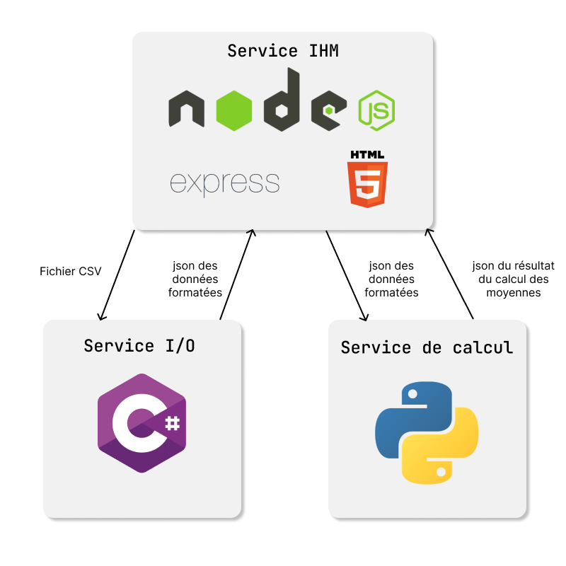

# avg-grade-ultimate
Average grade calculator solution with Docker

|   |port |
|---|---|
|serveur web (node)| 3000
|service input/ouput (c#)| 5000
|service calcul (python)| 5001

Chaque service communique grâce à une api.

